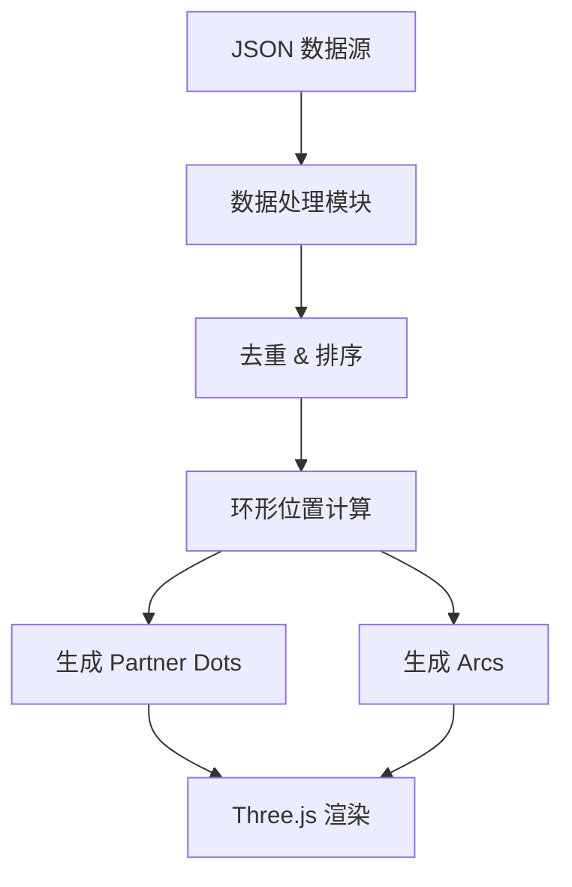

## Product Overview

修复 RIOT 动画项目中合作伙伴点（partner dots）和弧线（arcs）的生成逻辑，确保每个 POP 节点正确显示去重后的合作伙伴点，并使用确定性的环形定位算法。

## Core Features

- **合作伙伴去重**: 在生成点和弧线之前，对合作伙伴名称进行去重处理
- **确定性排序**: 按字母顺序排序合作伙伴，确保每次渲染结果一致
- **环形定位计算**: 忽略 JSON 中原始的 lat/lng，使用 ringRadiusDeg=1.2 和 cos(lat) 经度校正重新计算位置
- **精确点数显示**: 每个 POP 显示 N 个点，N = 唯一合作伙伴数量
- **弧线连接**: 弧线从 POP 中心点连接到每个合作伙伴点位置

## Tech Stack

- 语言: JavaScript (ES6+)
- 框架: 原生 JS + Three.js (现有项目)
- 修改范围: 仅修改 `src/main.js` 中的数据处理函数

## Tech Architecture

### System Architecture



### Module Division

- **数据预处理模块**: 负责合作伙伴名称去重和字母排序
- **位置计算模块**: 使用环形数学公式计算每个合作伙伴点的位置
- **渲染数据生成模块**: 生成点和弧线的渲染数据

### Data Flow

1. 从 JSON 加载 POP 及其合作伙伴数据
2. 对每个 POP 的合作伙伴列表进行去重
3. 按字母顺序排序合作伙伴
4. 使用环形算法计算每个合作伙伴点的位置（ringRadiusDeg=1.2，应用 cos(lat) 校正）
5. 生成从 POP 中心到各合作伙伴点的弧线数据
6. 传递给 Three.js 进行渲染

## Implementation Details

### Core Directory Structure

```
project-root/
├── src/
│   └── main.js    # 修改: 数据处理函数
```

### Key Code Structures

**合作伙伴去重与排序逻辑**:

```javascript
// 去重并排序合作伙伴
function processPartners(partners) {
  const uniquePartners = [...new Set(partners.map(p => p.name))];
  return uniquePartners.sort((a, b) => a.localeCompare(b));
}
```

**环形位置计算**:

```javascript
// 计算合作伙伴点位置
function calculatePartnerPosition(popLat, popLng, index, totalCount, ringRadiusDeg = 1.2) {
  const angle = (2 * Math.PI * index) / totalCount;
  const latOffset = ringRadiusDeg * Math.sin(angle);
  const lngOffset = (ringRadiusDeg * Math.cos(angle)) / Math.cos(popLat * Math.PI / 180);
  return {
    lat: popLat + latOffset,
    lng: popLng + lngOffset
  };
}
```

### Technical Implementation Plan

1. **问题**: 合作伙伴点重复且位置不确定
2. **方案**: 在数据处理阶段添加去重、排序和位置重计算逻辑
3. **关键技术**: Set 去重、localeCompare 排序、三角函数环形布局
4. **实现步骤**:

- 定位现有的合作伙伴数据处理函数
- 添加去重逻辑
- 添加字母排序逻辑
- 重写位置计算使用环形算法
- 更新弧线生成逻辑

5. **验证**: 检查每个 POP 的点数是否等于唯一合作伙伴数，弧线是否正确连接

## Agent Extensions

### SubAgent

- **code-explorer**
- Purpose: 探索 src/main.js 中现有的合作伙伴数据处理逻辑，定位需要修改的函数
- Expected outcome: 找到处理 partner dots 和 arcs 生成的具体代码位置和实现方式