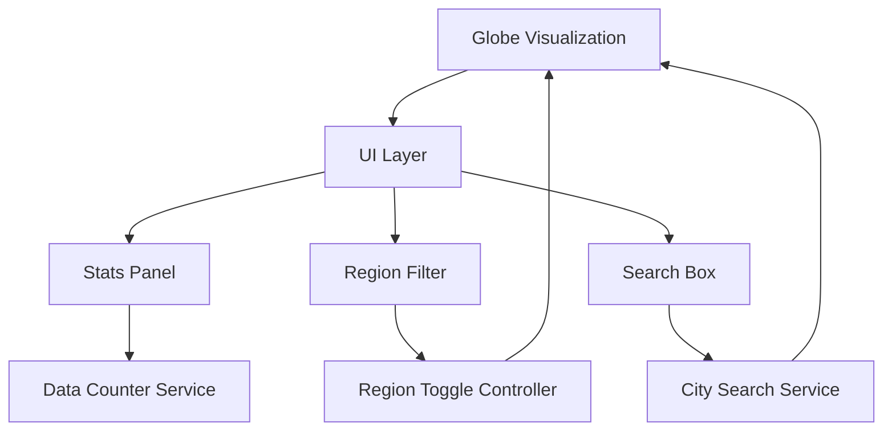

## Product Overview

为现有的3D地球可视化项目添加三个UI交互功能，增强用户体验和数据展示能力。

## Core Features

- **统计面板 (Stats Panel)**: 在界面上显示实时统计数据，包括POPs数量、合作伙伴数量、区域数量等关键指标
- **区域过滤按钮 (Region Filter)**: 提供APAC/EMEA/NA/LATAM四个区域的切换按钮，用户可点击显示或隐藏特定区域的数据点
- **搜索框 (Search Box)**: 带自动补全功能的搜索输入框，用户可搜索城市名称并自动飞行定位到目标城市位置

## Tech Stack

- 前端框架: 沿用现有项目技术栈 (HTML/CSS/JavaScript + Three.js)
- 3D渲染: Three.js (现有)
- UI组件: 原生HTML/CSS实现，保持与现有风格一致

## Tech Architecture

### System Architecture



### Module Division

- **Stats Panel Module**: 实时统计数据展示组件，监听数据变化并更新显示
- **Region Filter Module**: 区域过滤控制器，管理四个区域的可见性状态
- **Search Module**: 城市搜索服务，包含自动补全逻辑和相机飞行动画控制

### Data Flow

用户交互 → UI组件状态更新 → 过滤/搜索逻辑处理 → Three.js场景更新 → 相机动画/点位显隐

## Implementation Details

### Core Directory Structure

```
project-root/
├── src/
│   ├── components/
│   │   ├── StatsPanel.js      # 新增: 统计面板组件
│   │   ├── RegionFilter.js    # 新增: 区域过滤按钮组件
│   │   └── SearchBox.js       # 新增: 搜索框组件
│   ├── services/
│   │   ├── regionController.js # 新增: 区域显隐控制服务
│   │   └── citySearch.js      # 新增: 城市搜索服务
│   └── styles/
│       └── ui-features.css    # 新增: UI功能样式
```

### Key Code Structures

**Region Filter State**: 管理四个区域的可见性状态

```javascript
const regionState = {
  APAC: true,
  EMEA: true,
  NA: true,
  LATAM: true
};
```

**Search Service Interface**: 城市搜索和自动补全接口

```javascript
class CitySearchService {
  search(query): City[]  // 返回匹配的城市列表
  flyToCity(city): void  // 相机飞行到指定城市
}
```

### Technical Implementation Plan

1. **Stats Panel**: 从现有数据源提取统计信息，创建固定位置的overlay面板
2. **Region Filter**: 基于城市数据的region字段进行过滤，控制Three.js中对应点位的visible属性
3. **Search Box**: 实现城市名称模糊匹配，选中后使用Three.js相机动画飞行到目标位置

## Design Style

延续现有地球可视化的深色科技风格，UI组件采用半透明玻璃拟态设计，悬浮于地球场景之上。

## Page Design

### Stats Panel (左上角)

- 位置: 固定于视窗左上角
- 样式: 半透明深色背景，圆角卡片
- 内容: 垂直排列显示POPs、Partners、Regions三项数据，每项包含图标、数字和标签
- 动效: 数字变化时有轻微的计数动画

### Region Filter (右上角)

- 位置: 固定于视窗右上角
- 样式: 水平排列的四个胶囊形按钮
- 交互: 点击切换激活/禁用状态，激活状态有高亮边框和背景色
- 按钮: APAC、EMEA、NA、LATAM四个区域标签

### Search Box (顶部居中)

- 位置: 固定于视窗顶部居中
- 样式: 圆角搜索输入框，带搜索图标
- 功能: 输入时显示下拉补全列表，列表项显示城市名和区域
- 交互: 选中城市后输入框显示城市名，地球自动飞行到该位置

## Agent Extensions

### SubAgent

- **code-explorer**
- Purpose: 探索现有项目结构，了解地球可视化的实现方式、数据结构和现有组件
- Expected outcome: 获取现有代码架构信息，确定最佳集成方式