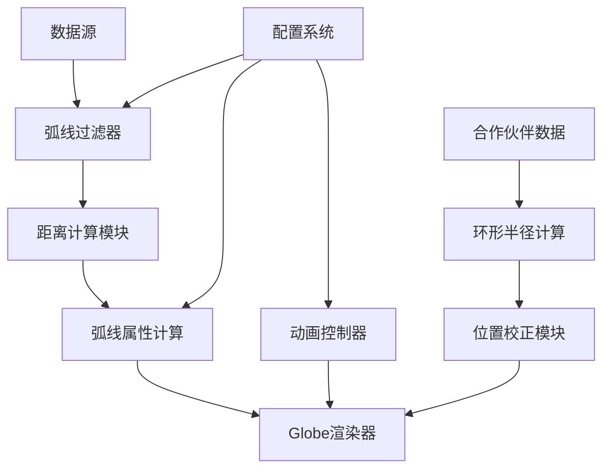
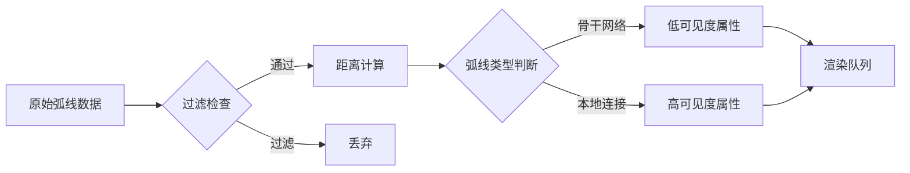

## Product Overview

为 RIOT 动画项目的 3D 地球可视化组件实现 5 项视觉优化，提升弧线显示效果、合作伙伴定位精度和整体动画控制能力。

## Core Features

1. **弧线过滤机制** - 过滤自连接弧线（partner name="Tencent"）和短距离重复弧线（距离<10-30km）
2. **弧线可见性优化** - 基于距离动态调整弧线高度（短距离0.18，长距离0.10-0.12）和描边粗细
3. **动态环形半径定位** - 根据合作伙伴数量动态计算环形半径（2-4个→0.6-0.9°，5-8个→1.0-1.4°，9+个→1.6-2.2°），包含纬度余弦校正和限制
4. **弧线层级视觉区分** - 骨干网络弧线采用低透明度、细描边、慢动画；本地弧线更亮、更明显的运动效果
5. **全局动画开关** - 添加 ENABLE_ANIMATION 配置标志，控制虚线动画和自动旋转功能

## Tech Stack

- 框架：基于现有项目的 JavaScript/TypeScript
- 3D 渲染：Three.js + Globe.gl
- 配置管理：项目现有配置系统

## Tech Architecture

### System Architecture



### Module Division

- **弧线过滤模块**：负责过滤自连接和短距离弧线
- **距离计算模块**：计算两点间地理距离，用于动态属性调整
- **弧线属性模块**：根据距离和类型计算高度、描边、透明度
- **环形定位模块**：动态计算合作伙伴环形半径并应用纬度校正
- **动画控制模块**：全局动画开关管理

### Data Flow



## Implementation Details

### Core Directory Structure

```
project-root/
├── src/
│   ├── config/
│   │   └── globeConfig.js      # 修改: 添加动画开关和弧线参数
│   ├── utils/
│   │   ├── arcFilter.js        # 新增: 弧线过滤逻辑
│   │   ├── distanceUtils.js    # 新增: 距离计算工具
│   │   └── ringRadius.js       # 新增: 动态环形半径计算
│   └── components/
│       └── Globe/
│           └── arcRenderer.js  # 修改: 弧线渲染属性优化
```

### Key Code Structures

**弧线过滤接口**：定义弧线过滤规则，包含自连接检测和距离阈值判断。

```typescript
interface ArcFilterConfig {
  selfName: string;           // 自身名称用于过滤
  minDistanceKm: number;      // 最小距离阈值 (10-30km)
}

function shouldFilterArc(arc: ArcData, config: ArcFilterConfig): boolean
```

**弧线属性计算**：根据距离动态计算弧线高度和描边。

```typescript
interface ArcVisualProps {
  altitude: number;    // 0.10-0.18 based on distance
  strokeWidth: number; // 距离相关描边粗细
  opacity: number;     // 骨干 vs 本地透明度
  dashSpeed: number;   // 动画速度
}

function calculateArcProps(distanceKm: number, isBackbone: boolean): ArcVisualProps
```

**环形半径计算**：根据合作伙伴数量和纬度动态计算定位半径。

```typescript
interface RingRadiusConfig {
  partnerCount: number;
  latitude: number;
}

function calculateRingRadius(config: RingRadiusConfig): number
// 2-4 partners → 0.6-0.9°
// 5-8 partners → 1.0-1.4°
// 9+ partners  → 1.6-2.2°
// Apply cos(lat) correction
```

### Technical Implementation Plan

**1. 弧线过滤实现**

- 问题：需要过滤无效和重复弧线
- 方案：在数据预处理阶段添加过滤函数
- 步骤：检查partner名称 → 计算距离 → 应用阈值过滤

**2. 距离-属性映射**

- 问题：不同距离弧线需要不同视觉表现
- 方案：线性插值计算高度和描边
- 步骤：计算Haversine距离 → 映射到属性范围 → 应用到渲染

**3. 动态环形定位**

- 问题：合作伙伴密集时位置重叠
- 方案：基于数量动态扩展半径，纬度校正
- 步骤：统计数量 → 查表获取基础半径 → 应用cos校正

**4. 弧线类型区分**

- 问题：骨干和本地弧线需要视觉区分
- 方案：不同的透明度、描边、动画参数
- 步骤：判断弧线类型 → 应用对应样式配置

**5. 全局动画控制**

- 问题：需要统一控制动画开关
- 方案：配置标志 + 条件渲染
- 步骤：定义配置 → 动画逻辑判断 → 自动旋转控制

## Agent Extensions

### SubAgent

- **code-explorer**
- Purpose: 探索现有项目结构，理解当前弧线渲染逻辑、配置系统和Globe组件实现
- Expected outcome: 获取现有代码结构、关键文件位置和修改点的完整理解