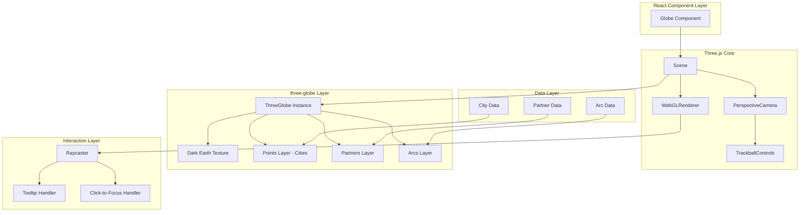
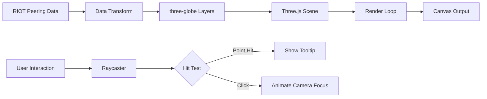

## Product Overview

将现有的 globe.gl 地球可视化组件重构为使用底层的 three-globe 库，配合手动 Three.js 场景设置，实现更精细的控制和暗色地球纹理效果，同时保留所有 RIOT 对等互联数据的可视化功能。

## Core Features

- 使用 three-globe 库替代 globe.gl，获得更底层的控制能力
- 手动设置 Three.js 场景、相机、渲染器
- 使用 earth-dark.jpg 暗色地球纹理
- 集成 TrackballControls 实现球体交互控制
- 保留城市节点（cities）可视化
- 保留合作伙伴节点（partners）可视化
- 保留连接弧线（arcs）可视化
- 保留工具提示（tooltips）交互功能
- 保留点击聚焦（click-to-focus）功能

## Tech Stack

- 核心库：three-globe（底层地球可视化）
- 3D 引擎：Three.js（手动场景管理）
- 控制器：TrackballControls（球体交互）
- 纹理：earth-dark.jpg（暗色地球）
- 框架：保持现有 React + TypeScript 架构

## Tech Architecture

### System Architecture



### Module Division

**Three.js 核心模块**

- 职责：创建和管理 Scene、Camera、Renderer
- 技术：Three.js WebGLRenderer、PerspectiveCamera
- 接口：初始化、渲染循环、窗口调整

**three-globe 模块**

- 职责：创建地球实例并配置图层
- 技术：three-globe 库
- 接口：globeImageUrl、pointsData、arcsData

**控制器模块**

- 职责：实现球体旋转、缩放交互
- 技术：TrackballControls
- 依赖：Camera、Renderer.domElement

**交互模块**

- 职责：处理点击、悬停事件
- 技术：Raycaster、事件监听
- 接口：tooltip 显示、相机聚焦动画

### Data Flow



## Implementation Details

### Core Directory Structure

```
src/
├── components/
│   └── Globe/
│       ├── Globe.tsx              # 重构：主组件
│       ├── useThreeScene.ts       # 新增：Three.js 场景 Hook
│       ├── useGlobeInstance.ts    # 新增：three-globe 实例 Hook
│       ├── useInteractions.ts     # 重构：交互处理 Hook
│       └── types.ts               # 保留：类型定义
├── assets/
│   └── textures/
│       └── earth-dark.jpg         # 新增：暗色地球纹理
```

### Key Code Structures

**Three.js 场景初始化结构**

```typescript
interface ThreeSceneConfig {
  container: HTMLElement;
  width: number;
  height: number;
}

interface ThreeSceneReturn {
  scene: THREE.Scene;
  camera: THREE.PerspectiveCamera;
  renderer: THREE.WebGLRenderer;
  controls: TrackballControls;
}
```

**three-globe 配置结构**

```typescript
interface GlobeConfig {
  globeImageUrl: string;  // earth-dark.jpg
  pointsData: CityPoint[];
  arcsData: ArcData[];
  pointAltitude: number;
  arcColor: string | Function;
}
```

**交互处理结构**

```typescript
interface InteractionHandlers {
  onPointHover: (point: CityPoint | null) => void;
  onPointClick: (point: CityPoint) => void;
  onArcHover: (arc: ArcData | null) => void;
}
```

### Technical Implementation Plan

**1. Three.js 场景手动设置**

- 问题：需要替换 globe.gl 的自动场景管理
- 方案：创建 useThreeScene Hook 手动初始化
- 步骤：创建 Scene → 配置 Camera → 初始化 Renderer → 绑定 TrackballControls → 启动渲染循环

**2. three-globe 集成**

- 问题：从 globe.gl 迁移到 three-globe
- 方案：使用 three-globe 实例并添加到 Scene
- 步骤：创建 ThreeGlobe 实例 → 设置暗色纹理 → 配置数据图层 → 添加到 Scene

**3. 交互系统重建**

- 问题：three-globe 不内置交互处理
- 方案：使用 Raycaster 实现点击检测
- 步骤：监听鼠标事件 → Raycaster 射线检测 → 识别命中对象 → 触发对应回调

### Integration Points

- three-globe 实例通过 `scene.add(globe)` 集成到 Three.js 场景
- TrackballControls 绑定到 camera 和 renderer.domElement
- Raycaster 与 globe 的 mesh 子对象进行碰撞检测
- 渲染循环中调用 controls.update() 和 renderer.render()

## Agent Extensions

### SubAgent

- **code-explorer**
- Purpose：深入分析现有 globe.gl 实现代码，理解当前数据结构、交互逻辑和组件架构
- Expected outcome：获取现有实现的完整代码结构，确保重构时保留所有功能特性