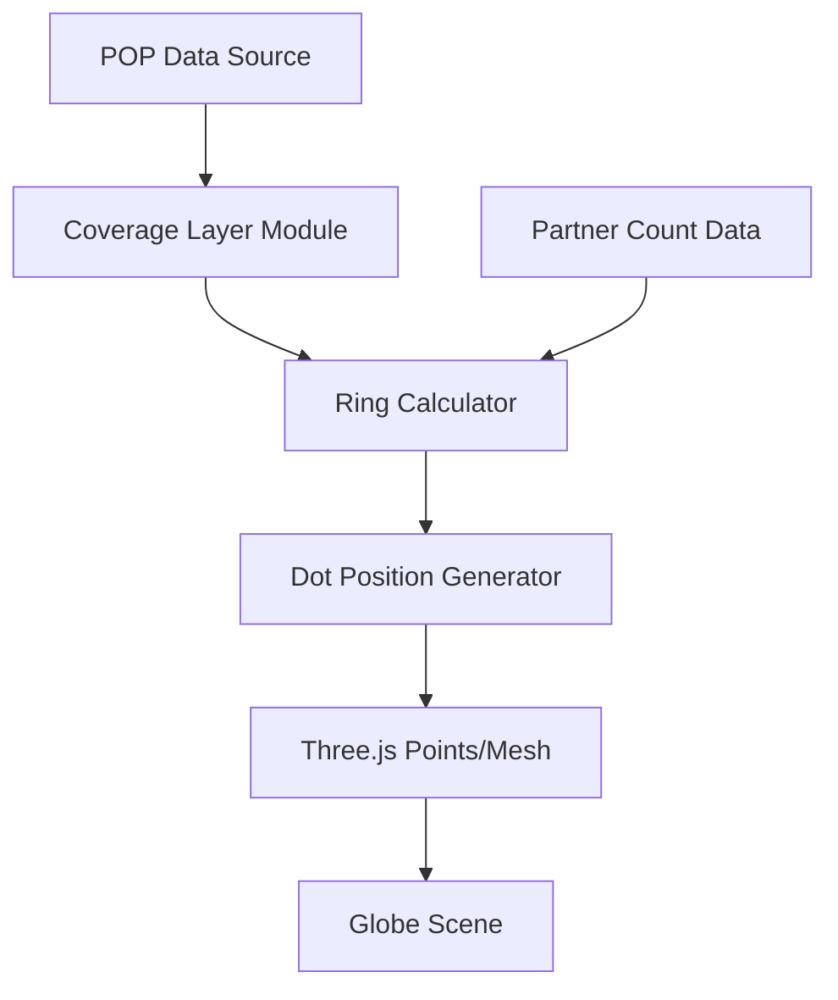

## Product Overview

为现有的 RIOT 动画地球可视化项目添加一个新的静态视觉图层，用于展示每个腾讯 POP 节点周围的本地 ISP/IX 覆盖密度。通过浅蓝色/青色的覆盖点以圆环形式分布在每个 POP 周围，直观呈现"每个 POP 被本地 ISP 包围，就近吸收流量"的叙事效果。

## Core Features

- **覆盖点渲染**: 在每个 POP 节点周围渲染浅蓝色/青色的小型半透明覆盖点，位置略高于地球表面
- **圆环排列布局**: 覆盖点以圆环形式排列，支持纬度校正的经度偏移计算，确保在不同纬度下视觉效果一致
- **动态半径缩放**: 圆环半径根据该 POP 的合作伙伴数量（partner count）进行缩放，合作伙伴越多覆盖范围越大
- **可选径向刻度线**: 支持添加细微的径向刻度线增强视觉层次感
- **静态常驻显示**: 图层始终可见，非交互式，无悬停触发，无激进动画效果

## Tech Stack

- 基于现有项目技术栈：HTML/CSS/JavaScript + Three.js
- 复用现有地球渲染和 POP 节点数据结构

## Tech Architecture

### System Architecture



### Module Division

- **Coverage Layer Module**: 新增覆盖图层的核心模块，负责创建和管理覆盖点
- **Ring Calculator**: 计算圆环布局，包含纬度校正算法和半径缩放逻辑
- **Dot Renderer**: 使用 Three.js Points 或 InstancedMesh 渲染覆盖点

### Data Flow

1. 读取 POP 节点位置和 partner count 数据
2. 为每个 POP 计算圆环半径和点位置（含纬度校正）
3. 生成 Three.js 几何体并添加到场景
4. 静态渲染，无需动画更新循环

## Implementation Details

### Core Directory Structure

```
project-root/
├── src/
│   ├── layers/
│   │   └── CoverageFanLayer.js    # 新增：覆盖点图层模块
│   ├── utils/
│   │   └── ringCalculator.js      # 新增：圆环位置计算工具
│   └── config/
│       └── coverageConfig.js      # 新增：覆盖图层配置参数
```

### Key Code Structures

**Coverage Dot Configuration**: 定义覆盖点的视觉参数配置。

```javascript
// 覆盖点配置
const coverageConfig = {
  dotColor: 0x00BFFF,        // 浅蓝/青色
  dotSize: 0.8,              // 点大小
  dotOpacity: 0.6,           // 半透明度
  heightOffset: 0.02,        // 略高于地球表面
  baseRadius: 0.05,          // 基础圆环半径
  radiusScale: 0.01,         // 每个partner的半径增量
  dotsPerRing: 12,           // 每环点数
  maxRings: 3                // 最大环数
};
```

**Ring Position Calculator**: 计算带纬度校正的圆环点位置。

```javascript
// 圆环位置计算（含纬度校正）
function calculateRingPositions(centerLat, centerLng, radius, dotCount) {
  const positions = [];
  const latCorrection = Math.cos(centerLat * Math.PI / 180);
  for (let i = 0; i < dotCount; i++) {
    const angle = (2 * Math.PI * i) / dotCount;
    const lat = centerLat + radius * Math.sin(angle);
    const lng = centerLng + (radius * Math.cos(angle)) / latCorrection;
    positions.push({ lat, lng });
  }
  return positions;
}
```

### Technical Implementation Plan

1. **问题**: 为每个 POP 生成环绕覆盖点
2. **方案**: 使用 Three.js Points 或 InstancedMesh 批量渲染，优化性能
3. **关键技术**: 球面坐标转换、纬度校正公式、实例化渲染
4. **实现步骤**:

- 创建 CoverageFanLayer 类
- 实现圆环位置计算（含纬度校正）
- 批量生成覆盖点几何体
- 集成到现有场景渲染流程

5. **验证**: 检查不同纬度 POP 的覆盖点分布是否均匀

## Agent Extensions

### SubAgent

- **code-explorer**
- Purpose: 探索现有项目结构，了解 POP 数据源、地球渲染逻辑和图层管理方式
- Expected outcome: 获取 POP 节点数据结构、partner count 字段位置、现有图层添加模式，确保新图层无缝集成