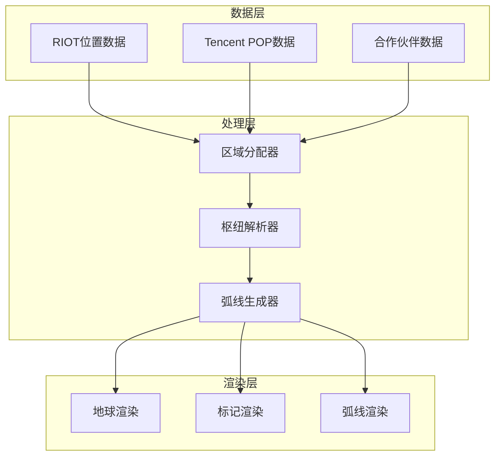
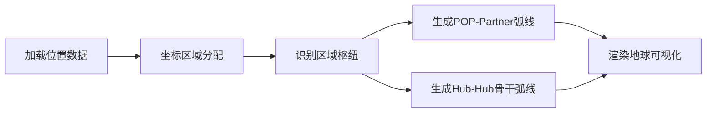

## Product Overview

重构地球可视化组件，实现清晰的枢纽-骨干网络模型。将 RIOT 位置转换为参考标记，Tencent POPs 作为主要网络节点并展示本地合作伙伴扇出弧线，4个区域枢纽通过骨干弧线连接。

## Core Features

- **RIOT 位置标记**: 作为参考点显示城市标签，不参与网络连接
- **Tencent POP 节点**: 作为主要网络节点，无标签显示
- **本地合作伙伴扇出弧线**: 从每个 POP 向其本地合作伙伴绘制扇形连接弧线，合作伙伴以小标签形式显示
- **区域枢纽系统**: 4个区域枢纽城市（新加坡-APAC、法兰克福-EMEA、洛杉矶-NA、圣保罗-LATAM）
- **骨干弧线**: 连接4个区域枢纽的微妙骨干网络弧线
- **地理坐标区域划分**: 基于经纬度自动分配区域（NA: lat>=15 & lng<=-30, LATAM: lat<15 & lng<=-30, EMEA: lng>-30 & lng<60, APAC: lng>=60）

## Tech Stack

- 前端框架: 基于现有项目结构（HTML/CSS/JavaScript + Three.js）
- 3D渲染: Three.js 地球可视化
- 数据处理: JavaScript 地理坐标计算

## Tech Architecture

### System Architecture



### Module Division

- **区域分配模块**: 根据地理坐标将节点分配到4个区域
- **枢纽解析模块**: 识别枢纽城市，处理缺失枢纽的回退逻辑
- **弧线生成模块**: 生成本地扇出弧线和骨干弧线
- **渲染模块**: 处理不同类型标记和弧线的可视化

### Data Flow



## Implementation Details

### Core Directory Structure

```
project-root/
├── src/
│   ├── data/
│   │   └── locations.js        # 修改: 更新位置数据结构
│   ├── utils/
│   │   ├── regionAssigner.js   # 新增: 区域分配逻辑
│   │   └── hubResolver.js      # 新增: 枢纽解析逻辑
│   ├── components/
│   │   ├── markers.js          # 修改: RIOT/POP/Partner标记渲染
│   │   └── arcs.js             # 修改: 扇出弧线和骨干弧线
│   └── globe.js                # 修改: 主渲染逻辑
```

### Key Code Structures

**区域分配函数**: 根据经纬度坐标判断节点所属区域

```javascript
function assignRegion(lat, lng) {
  if (lng >= 60) return 'APAC';
  if (lng > -30 && lng < 60) return 'EMEA';
  if (lng <= -30 && lat >= 15) return 'NA';
  if (lng <= -30 && lat < 15) return 'LATAM';
}
```

**枢纽城市配置**: 定义4个区域的枢纽城市

```javascript
const HUB_CITIES = {
  APAC: { name: 'Singapore', lat: 1.3521, lng: 103.8198 },
  EMEA: { name: 'Frankfurt', lat: 50.1109, lng: 8.6821 },
  NA: { name: 'Los Angeles', lat: 34.0522, lng: -118.2437 },
  LATAM: { name: 'São Paulo', lat: -23.5505, lng: -46.6333 }
};
```

**节点类型定义**: 区分三种节点的显示方式

```javascript
const NODE_TYPES = {
  RIOT: { showLabel: true, labelType: 'city', participateInNetwork: false },
  POP: { showLabel: false, labelType: null, participateInNetwork: true },
  PARTNER: { showLabel: true, labelType: 'small', participateInNetwork: true }
};
```

### Technical Implementation Plan

1. **区域分配系统**

- 问题: 需要根据地理坐标自动分配区域
- 方案: 实现基于坐标的区域判断函数
- 步骤: 解析坐标 → 应用区域规则 → 返回区域标识

2. **枢纽解析与回退**

- 问题: 枢纽城市可能不在POP列表中
- 方案: 优先匹配枢纽城市，缺失时计算最近POP作为回退
- 步骤: 查找枢纽 → 若缺失计算距离 → 选择最近POP

3. **弧线分层渲染**

- 问题: 需要区分本地扇出弧线和骨干弧线
- 方案: 使用不同样式和层级渲染两类弧线
- 步骤: 分类弧线 → 设置样式 → 分层渲染

## Agent Extensions

### SubAgent

- **code-explorer**
- Purpose: 探索现有项目结构，理解当前地球可视化实现方式，定位需要修改的文件和函数
- Expected outcome: 获取完整的项目文件结构、现有数据格式、Three.js渲染逻辑的详细信息