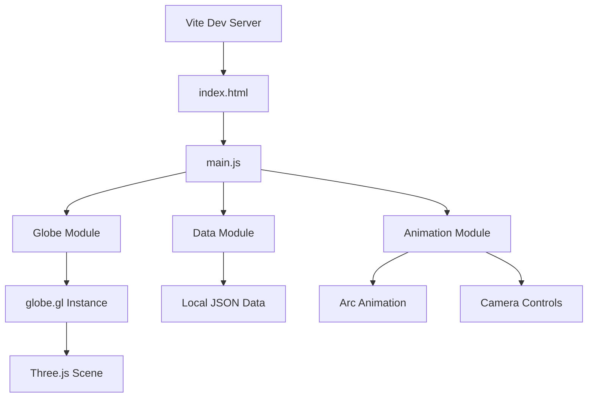
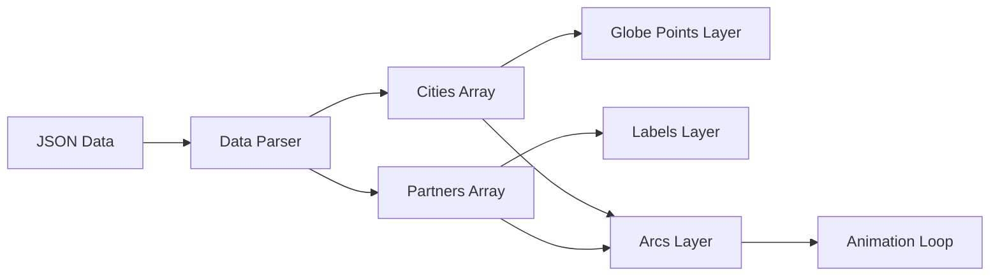

## Product Overview

一个基于浏览器的3D地球动画应用，展示RIOT Games的对等网络覆盖范围。地球上显示城市标记点，通过动画虚线弧线连接到合作伙伴标签，呈现全球网络分布的可视化效果。

## Core Features

- 自动旋转的3D地球，支持鼠标拖拽交互
- 红色城市标记点，带有城市名称标签
- 合作伙伴标签环绕城市显示
- 动画虚线弧线连接城市与合作伙伴
- 鼠标悬停显示详细信息工具提示
- 点击城市触发相机飞行聚焦动画

## Tech Stack

- 构建工具: Vite
- 开发语言: Vanilla JavaScript (ES6+)
- 3D引擎: Three.js
- 地球库: globe.gl
- 数据格式: 本地JSON文件

## Tech Architecture

### System Architecture



### Module Division

- **Globe Module**: 初始化globe.gl实例，配置地球材质、光照和渲染参数
- **Data Module**: 加载和解析本地JSON数据，提供城市和合作伙伴信息
- **Animation Module**: 管理弧线动画、相机飞行和自动旋转逻辑
- **UI Module**: 处理工具提示、标签渲染和交互事件

### Data Flow



## Implementation Details

### Core Directory Structure

```
riot-globe-animation/
├── index.html
├── vite.config.js
├── package.json
├── public/
│   └── data/
│       └── peering-data.json
├── src/
│   ├── main.js
│   ├── modules/
│   │   ├── globe.js
│   │   ├── data.js
│   │   ├── animation.js
│   │   └── ui.js
│   ├── styles/
│   │   └── main.css
│   └── utils/
│       └── helpers.js
```

### Key Code Structures

**数据结构定义**: 定义城市和合作伙伴的数据格式，包含地理坐标和关联关系。

```javascript
// peering-data.json structure
{
  "cities": [
    {
      "id": "city-1",
      "name": "Los Angeles",
      "lat": 34.0522,
      "lng": -118.2437,
      "partners": ["partner-1", "partner-2"]
    }
  ],
  "partners": [
    {
      "id": "partner-1",
      "name": "Partner Name",
      "cityId": "city-1"
    }
  ]
}
```

**Globe配置接口**: globe.gl实例的核心配置，包括点、弧线和标签图层。

```javascript
// Globe initialization
const globe = Globe()
  .globeImageUrl(earthTexture)
  .pointsData(cities)
  .pointLat('lat')
  .pointLng('lng')
  .pointColor(() => '#ff0000')
  .arcsData(arcs)
  .arcDashLength(0.4)
  .arcDashGap(0.2)
  .arcDashAnimateTime(1500)
  .labelsData(labels)
  .onPointClick(handleCityClick);
```

### Technical Implementation Plan

**1. 地球渲染实现**

- 问题: 创建可交互的3D地球
- 方案: 使用globe.gl封装Three.js场景
- 技术: globe.gl + 自定义地球纹理
- 步骤: 初始化容器 → 配置地球参数 → 添加光照 → 启用控制器
- 验证: 地球可正常旋转和缩放

**2. 数据点渲染**

- 问题: 在地球上显示城市标记
- 方案: 使用Points Layer渲染红色标记点
- 技术: globe.gl pointsData API
- 步骤: 加载JSON → 解析坐标 → 配置点样式 → 添加标签
- 验证: 所有城市正确显示在对应位置

**3. 弧线动画**

- 问题: 创建城市到合作伙伴的动画连线
- 方案: 使用Arcs Layer配置虚线动画
- 技术: arcDashLength + arcDashAnimateTime
- 步骤: 构建弧线数据 → 配置动画参数 → 设置颜色渐变
- 验证: 弧线呈现流动动画效果

**4. 交互功能**

- 问题: 实现悬停提示和点击飞行
- 方案: 使用globe.gl事件回调 + pointOfView API
- 技术: onPointHover + onPointClick + pointOfView
- 步骤: 绑定事件 → 创建提示框 → 计算相机位置 → 执行动画
- 验证: 交互响应流畅，动画平滑

## Technical Considerations

### Performance Optimization

- 使用requestAnimationFrame优化渲染循环
- 限制同时显示的弧线数量
- 对标签使用CSS transform避免重绘
- 实现视锥体剔除减少渲染负载

### Security Measures

- 本地JSON数据无需网络请求验证
- 用户输入事件做节流处理

## Design Style

采用暗色科技风格，突出地球的视觉效果和数据可视化元素。深色背景配合霓虹色调的标记和弧线，营造专业的数据可视化氛围。

## Page Design

### Main View

- **Globe Container**: 全屏3D地球视图，深空背景带微弱星点
- **City Pins**: 红色发光标记点，带脉冲动画效果
- **City Labels**: 白色城市名称，半透明背景
- **Partner Labels**: 环绕城市分布，使用辅助色区分
- **Arc Lines**: 红色渐变虚线，流动动画效果
- **Tooltip**: 悬停时显示详细信息卡片
- **Controls Hint**: 底部操作提示文字